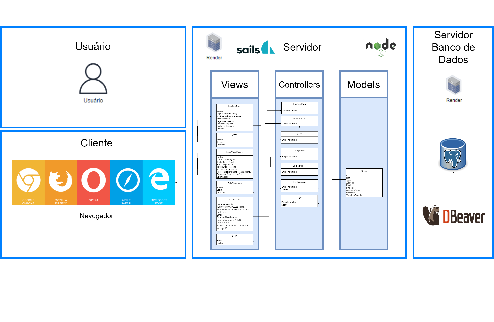
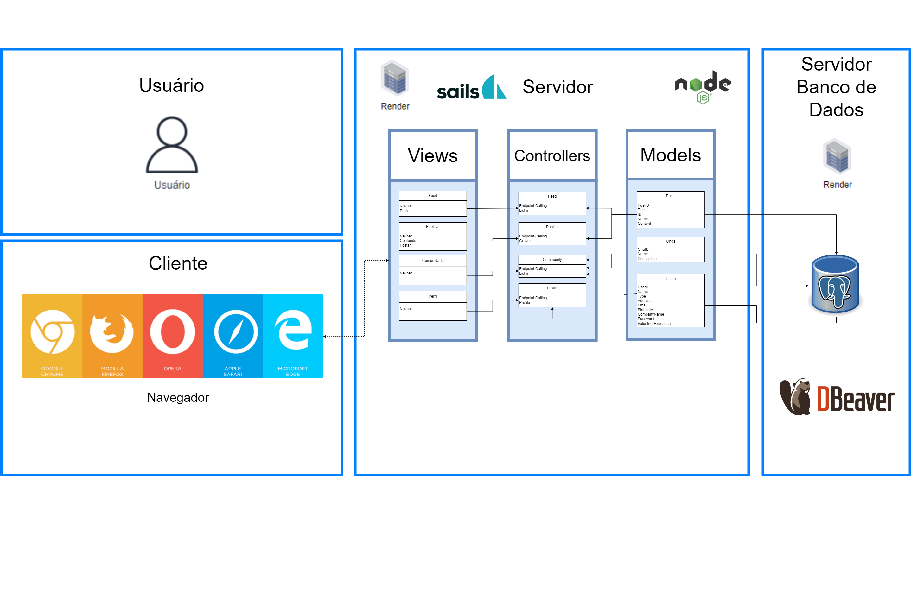

#  Diagrama MVC

## Arquitetura da Solução 
&nbsp;&nbsp;&nbsp;&nbsp;<b>Objetivo Principal:</b> O propósito fundamental desta aplicação web, desenvolvida com o auxílio do framework Sails.js, é estabelecer uma plataforma sólida e eficaz. Nela, a interação do usuário é facilitada por uma interface criada com HTML, CSS e Javascript, proporcionando uma experiência fluída e intuitiva.

&nbsp;&nbsp;&nbsp;&nbsp;Ao fundo, a interface interage dinamicamente com uma API backend construída em Node.js, seguindo a arquitetura MVC e utilizando o framework Sails.js. Essa API, desenvolvida com uma arquitetura moderna e escalável, facilita a comunicação eficiente entre o front-end e o banco de dados PostgreSQL.

&nbsp;&nbsp;&nbsp;&nbsp;Desta forma, a aplicação não apenas oferece uma interface elegante e responsiva para os usuários finais, mas também estabelece uma base sólida e confiável para o desenvolvimento e manutenção contínua da plataforma. Além disso, a modularidade e extensibilidade do Sails.js facilitam a integração de novos recursos e funcionalidades

## Escopo 
&nbsp;&nbsp;&nbsp;&nbsp;<b>Gestão de Usuários:</b> Registro, login e logout de usuários, controle de acesso às funcionalidades da plataforma.

&nbsp;&nbsp;&nbsp;&nbsp;<b>Feed de Ideias:</b> Publicação, classificação e filtragem de ideias por categorias ou tags, pesquisa avançada por ideias.

&nbsp;&nbsp;&nbsp;&nbsp;<b>Comunidade:</b> Catálogo de ONGs cadastradas, visualização de detalhes sobre cada ONG (missão, projetos e contatos), recursos para engajamento com as ONGs (doações e voluntariado), listagem de projetos para replicação com informações detalhadas sobre objetivos, metodologia e recursos necessários.

## Landing Page 
&nbsp;&nbsp;&nbsp;&nbsp;Para melhor visualização e organização, dividimos os diagramas em 2: Landing Page e Plataforma. Para o de plataforma, o usuário terá acesso à uma página inicial com informações que o levarão à tela de login/cadastro. Nas demais páginas, a nossa API responderá somente a solicitações de listagem (GET) e a chamadas de endpoint para o frontend.

## Plataforma 
&nbsp;&nbsp;&nbsp;&nbsp;Já dentro da plataforma, o usuário terá acesso às funcionalidades descritas anteriormente, que recaem diretamento sobre as interações com o banco de dados como: postagens no feed e procuras diversas por ações, voluntário ou emoresas/ONG's.

